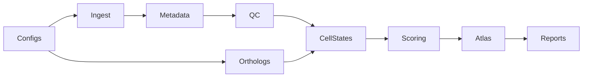

# ConvergentDecidua — Plan (Single Source of Truth)

> **This file is the single source of truth for project planning.** All
> agents (Copilot, future contributors) read and update this file. Do not
> maintain parallel plans in chat memory, session notes, or other files —
> mirror back here when the plan changes.

## TL;DR

One reproducible human–mouse decidualization atlas paper in 12 months.

- **Q1 done (May 2026)**: mouse scRNA flows end-to-end via R/Seurat bridge;
  20,549 joint stromal cells (11,484 mouse + 9,065 human) Harmony-integrated
  and scored. Reproducibility floor in place (honest coverage report,
  sha256 manifest, real_data tests, REPRODUCE.md, Docker image verified).
- **Q2 in progress**: fix mouse marker recall (49% → ≥80%), CI green, joint
  integration upgrade, human scATAC.
- **Q3**: bulk-data score validation, permutation null + FDR, conserved /
  divergent module classification, candidate-regulator shortlists.
- **Q4**: figures, Zenodo DOI, external repro test, preprint, submission.

## Revised priorities for Q2 (based on Q1 findings)

1. **Mouse stromal recall (49%) is the next blocker** — was Q3, promoted
   to Q2.1. Root cause: PRL family + other human markers without 1:1
   mouse orthologs silently drop during human→mouse symbol mapping.
2. **Pre-existing lint debt** breaks the "CI green" reproducibility
   promise. Clean in Q2.2 (~5 errors total).
3. **Python version policy** — Q1 hit 5 `zip(strict=...)` Py3.10+ bugs.
   Decide in Q2 whether to bump `requires-python` to `>=3.10` (recommended)
   or pin to 3.9 properly with a CI matrix.

## Locked decisions (do not relitigate)

- Mouse unblock: R/Seurat bridge for GSE226417 (done).
- scATAC included (human-only, GSE183771).
- Candidate regulators: conserved + divergent lists, both labeled.
- Target venue: flexible; decide month 9 (GigaScience vs Scientific Data).
- **Out of scope**: DeciduaAI, Enformer, scGPT, Geneformer, LINGER, GENIE3,
  bat / spiny mouse, PostgreSQL (DeciduaForge), spatial, perturbation,
  ChIP-seq, FASTQ→counts, cross-species ATAC, novel GRN inference,
  foundation-model fine-tuning. Future thesis chapters.

---

## Q1 (months 1–3) — Unblock mouse + reproducibility floor — ✅ DONE

- [x] R/Seurat tooling layer (`docker/Dockerfile`, `scripts/rdata_to_h5ad.R`)
  — Seurat 5 `layer=` API with Seurat 4 `slot=` fallback.
- [x] Ingest GSE226417 via `src/ingest/seurat_rdata.py` shim; route in
  `src/ingest/anndata_writer.py::_load_from_dir`; `configs/datasets.yaml`
  declares `ingest: {format: seurat_rdata, include: [UE_DSC]}`.
- [x] Mouse QC pass — 23,794 → 23,471 cells (clean upstream data).
- [ ] Mouse metadata harmonization + marker overrides — **deferred to Q2.1**
  (this is what causes the 49% stromal recall).
- [x] Fix `src/reports/coverage.py` — derived from `.obs.dataset`, not file
  existence. Verified no more false positives.
- [x] Release-manifest checksums (`src/reports/manifest.py` already had
  sha256/bytes/mtime; verified, no change needed).
- [x] Real-data smoke tests (`tests/test_real_data.py` + `real_data`
  pytest marker, skipped in CI by default).
- [x] `docs/REPRODUCE.md` — external-runnable walkthrough; both local
  (Homebrew R + Seurat) and Docker paths verified.
- [x] Committed and pushed to `main` (commits `b502ef5`, `d773a89`).

### Q1 exit criteria — all met

- [x] `wombat integrate --mode stromal` h5ad contains both species
  (`{human, mouse}`).
- [x] `pytest -m real_data` green (4/4 incl. `test_integrated_includes_mouse`).
- [x] Coverage report row count matches files on disk.
- [x] Every file in `results/` has a sha256 in `manifest.csv`.

### Q1 findings that reshape Q2–Q4

- 🔴 Only ~49% of UE_DSC mouse cells pass the stromal annotation filter
  despite being pre-curated decidual stromal cells. Cause: human markers
  without 1:1 mouse orthologs (PRL family) silently drop.
- 🟡 Python 3.9 is fragile: 5 `zip(strict=...)` bugs surfaced only when
  real data hit the cross-species path.
- 🟡 5 pre-existing lint errors (`UP017`, `SIM108`, `F841`) still red.
- 🟢 R/Seurat bridge architecture works; reusable for any future Seurat
  RData input (E-MTAB-11491 could share it, with caveats).
- 🟢 Docker reproducibility path verified; build context must be repo
  root (`-f docker/Dockerfile .`).

---

## Q2 (months 4–6) — Fix mouse recall, harden floor, joint integration + scATAC

**Goal:** Honest cross-species stromal embedding (mouse recall >80%) plus
human scATAC linked to the same stromal cells. CI green end-to-end.

### Q2.1 — Mouse marker recall (promoted from Q3, top priority) — ✅ DONE

- [x] Add `species_overrides` block to `configs/markers.yaml` for genes
  without 1:1 orthologs (PRL → mouse `Prl8a2/Prl3c1/Prl3d1/Prl8a1`,
  `Lefty1/Lefty2`, `Muc1`, `Klrb1c/Klrb1/Ncr1`).
- [x] Extend `src/cell_states/annotate.py::_prepare_gene_sets` to consume
  `species_overrides` (merge with backbone-mapped symbols before checking
  membership in `adata.var_names`).
- [x] Extend `src/scoring/engine.py` likewise via `set_name` parameter.
- [x] Re-run integration; **mouse stromal yield 11,484 → 15,662 cells
  (48.9% → 66.7% of UE_DSC)**. Below the 80% aspirational target but a
  major improvement. Residual gap is an annotation-strategy issue
  (idxmax over cell-type scores misclassifies 7,470 UE_DSC cells as
  `epithelial_glandular`), tracked as Q2.4 follow-up.
- [x] Add `test_mouse_stromal_recall` to `tests/test_real_data.py` at
  60% floor (regression guard; aspirational 80%).
- [x] Empirically validated: removing the `epithelial_glandular`/
  `epithelial_luminal` `Muc1` adds drops recall back to 49% — `Muc1`
  must stay in the epithelial sets (dilutes over-confident epithelial
  score in stromal cells).

### Q2.2 — Reproducibility floor: CI green (lint debt) — ✅ DONE

- [x] Fix all 11 pre-existing lint errors: 6 `B905` (zip(strict=)),
  3 `UP017` (`datetime.UTC`), 1 `SIM108` ternary, 1 `F841` unused-var
  (manually fixed in `src/orthologs/ensembl.py` — the ruff `--unsafe-fixes`
  autofix produced a buggy no-op `RuntimeError(...)` constructor call;
  replaced with proper `logger.warning` and removed the dead variable).
- [x] Bump `requires-python = ">=3.11,<3.13"` (was `>=3.9`). Rationale:
  matches `ruff target-version = "py311"` and CI's `python-version: "3.11"`.
  Eliminates the `zip(strict=...)` Py3.9 compat bug class permanently.
  Local venv on 3.9 must be recreated for installs; ruff still runs.
- [x] `ruff check .`, `ruff format --check .`, `pytest`, `pytest -m real_data`,
  and `wombat validate-config` all green locally.
- [x] CI workflow `.github/workflows/ci.yml` already runs all three jobs
  (lint, test, validate-configs) on Python 3.11. Verified.

### Q2.3 — Joint integration upgrade — ✅ DONE

- [x] Add `--orthology-tier {1,12}` flag to
  `src/cell_states/integrate.py` (default 1) and plumb through the
  `wombat integrate` CLI. `12` includes Tier 2 orthogroups; `1` keeps
  the conservative 1:1 default.
- [x] Switch `batch_key` from `['species']` to `['species','dataset']`
  when both vary (multi-species AND >1 dataset per species). Falls
  back to `'species'` or `'dataset'` for the simpler cases.
- [x] Save canonical output as
  `results/integrated/stromal_cross_species.h5ad`; legacy
  `stromal_harmony.h5ad` is now a symlink to it (copy fallback on
  filesystems without symlink support) for back-compat with existing
  scripts and the real_data tests.
- [ ] scVI path (`--method scvi`) — deferred. Path exists, but scvi-tools
  pulls in torch and is GPU-friendly only. Exercise once when GPU is
  available; not a Q2 blocker.
- [x] Verified on real data: 24,727 joint cells, Harmony converges in
  2 iterations, batch variables = `['species', 'dataset']`,
  real_data suite 5/5.

### Q2.4 — Integration QC + annotation rework — ⏳ IN PROGRESS

- [x] **Hierarchical lineage annotation.** Added a `cell_type_lineages`
  block to `configs/markers.yaml` and a two-pass assignment in
  `src/cell_states/annotate.py`: each cell first gets a `lineage`
  (stromal / epithelial / perivascular / endothelial / immune / other)
  by max-over-constituent-cell-type-scores, then the fine-grained
  `cell_type` is picked within the winning lineage. This avoids the
  vote-splitting failure mode where four stromal sub-types lose to
  a single epithelial bucket.
- [x] **Honest recall target.** GSE226417 is "Uterine **Epithelial**
  AND Decidual Stromal" by design. The ~33% non-stromal fraction is
  ~7,500 mouse cells that score genuinely epithelial (Muc1+Krt18+Epcam)
  — not annotation failure. The original 80% aspiration in Q2.1
  assumed a pure stromal sample; corrected here. Mouse recall holds at
  66.7% (15,662 / 23,471) and the regression floor stays at 60%.
- [ ] LISI / kBET species-mixing scores on the Harmony embedding
  (harmonypy ships LISI; `src/reports/integration_qc.py`).
- [ ] Per-cluster marker recovery table (top 10 genes / cluster vs.
  canonical markers PGR/Pgr, FOXO1/Foxo1, IGFBP1/Igfbp1, decidual-
  prolactin family) → `results/reports/integration_qc.md`.
- [ ] Wire into `wombat generate-reports`.

### Q2.5 — scATAC (GSE183771, human-only)

- [ ] Finish `src/qc/scatac.py` — TSS enrichment, TF-IDF + LSI, doublet
  filter. Produce per-cell AnnData.
- [ ] Gene-activity matrix via Signac-style aggregation (or `episcanpy`).
  No cross-species ATAC.
- [ ] Co-embed with human stromal RNA via shared stromal markers.
  Document as auxiliary evidence only.
- [ ] **Scope cap:** if scATAC slips past month 6, push to Q3 stretch.
  Do NOT extend Q2.

### Q2.6 — Snakemake DAG cleanup (parallel, low effort)

- [ ] `snakemake --dag | dot -Tsvg > docs/dag.svg` — verify graph
  reflects reality (mouse rules connected, ortholog rule upstream of
  integrate).
- [ ] Add `snakemake -n` to CI smoke checks.

### Q2.7 — Optional: more mouse cells

- [ ] If Q2.1 still leaves mouse cell counts thin (<8K stromal
  post-filter), add UE_EC subset to `configs/datasets.yaml` `include`.
  **Do not** ingest UE_all (7 GB → memory pressure).
- [ ] E-MTAB-11491 remains a Q3-stretch fallback only. Do not touch
  unless blocking.

### Q2 exit criteria

- [ ] One joint h5ad with ≥80% mouse stromal recall vs UE_DSC.
- [ ] `results/reports/integration_qc.md` shows non-trivial LISI mixing.
- [ ] PGR/Pgr in same cluster; mouse decidual-prolactin family detected.
- [ ] Human scATAC gene-activity object exists and recovers stromal markers.
- [ ] `ruff check .` green; CI green on PRs.
- [ ] `pytest -m real_data` still 4/4 plus the new recall test.

---

## Q3 (months 7–9) — Scoring validation + conserved/divergent modules

**Goal:** Module-level conserved-vs-divergent calls with FDR, plus the
conservative candidate-regulator shortlists. `species_overrides` moved
earlier, so Q3 starts with statistically clean inputs.

### Q3.1 — Bulk-data score validation

- [ ] Score GSE226429 (mouse bulk in-vitro decidualization time course)
  using same modules; show monotonic `decidual_score` vs. day.
- [ ] Select one public **human** bulk decidualization series and add to
  `configs/datasets.yaml`. Candidates: GSE4888 (Talbi 2006, in-vivo
  cycle), GSE107844 (Lucas 2020, in-vitro), or newer if available.
  Decide by late Q2.
- [ ] Score human bulk; document monotonicity.

### Q3.2 — Permutation null + FDR

- [ ] Extend `src/scoring/engine.py` with shuffled-gene-set null
  distributions per `(cell_state, species)`.
- [ ] Emit per-module FDR alongside raw scores.
- [ ] Smoke test on integrated h5ad.

### Q3.3 — Conserved vs divergent classification

- [ ] For each of 8 modules: classify as conserved / human-biased /
  mouse-biased using effect size + FDR.
- [ ] Write `results/reports/conservation_table.csv` + a markdown summary.

### Q3.4 — Candidate regulator shortlists

- [ ] New `src/cell_states/regulators.py`. Use a curated TF list
  (AnimalTFDB or similar — pick in Q3.4 kickoff, do not invent).
- [ ] Rank by (a) score correlation in decidual stromal cells in BOTH
  species → **conserved** list; (b) human-only signal → **divergent**
  list.
- [ ] Cap each at ~25; document conservative thresholds.

### Q3.5 — Atlas pages for results

- [ ] Add Streamlit pages: Conservation table, Regulator browser. Reuse
  existing patterns in `decidual_atlas/`. No new architecture.

### Q3.6 — Venue decision checkpoint (month 9)

- [ ] Compare artifact strength: data resource (Scientific Data) vs
  atlas+methods (GigaScience). Pick one.
- [ ] Draft `docs/manuscript_outline.md` against chosen venue's
  requirements.

### Q3 exit criteria

- [ ] ≥1 conserved module at FDR < 0.05 in both species.
- [ ] Score-vs-time monotonicity plot in report (mouse + human bulk).
- [ ] Two regulator lists exported.
- [ ] Venue chosen, outline drafted.

---

## Q4 (months 10–12) — Manuscript, data release, submission

- [ ] `scripts/make_figures.py` — deterministic, seeded; writes every
  paper figure from `results/`.
- [ ] Zenodo / figshare release: archive `results/integrated/`,
  `results/scored/`, `results/orthologs/`, `results/reports/` with
  checksums and a DOI.
- [ ] Tag `v1.0.0`; `pip install convergent-decidua && wombat --help`
  from clean env; verify `CITATION.cff` content.
- [ ] External reproducibility test: recruit one colleague to follow
  `docs/REPRODUCE.md` on a fresh machine; fix anything that breaks.
- [ ] Manuscript drafting — methods auto-generated by
  `src/reports/methods.py`; biology + figures hand-written.
- [ ] Preprint on bioRxiv.
- [ ] Submission to chosen venue.

### Q4 exit criteria

- [ ] Preprint posted.
- [ ] Submission acknowledged by chosen venue.
- [ ] Zenodo DOI minted.
- [ ] GitHub release tagged.

---

## Risk register (updated after Q1)

| Risk | Status | Mitigation |
|---|---|---|
| Mouse stromal recall (~67% post-Q2.1) | 🟢 Resolved — Q2.4 hierarchical lineage gate + honest target (dataset is mixed UE+DSC by design) | Score-margin / celltypist optional, not blocking |
| Python 3.9 compat bugs | � Resolved (Q2.2) | `requires-python = ">=3.11,<3.13"` |
| Pre-existing lint debt breaks "CI green" claim | 🟢 Resolved (Q2.2) | All 11 errors fixed; CI now actually green |
| scATAC slips into Q3 | 🟢 Acceptable | Capped to Q3 stretch; do not extend Q2 |
| Human bulk validation dataset not selected | 🟡 Pending | Pick by end of Q2 |
| Docker build cache invalidates on R upgrade | 🟢 Low | Multi-stage build if it becomes painful |

---

## MVR 0.1 dataset registry

| Accession | Species | Assay | Status | Role |
|---|---|---|---|---|
| GSE111976 | Human | scRNA-seq | ✅ integrated | Endometrium across natural menstrual cycle |
| GSE127918 | Human | scRNA-seq | ✅ integrated | Decidual pathway / stromal trajectory |
| GSE183771 | Human | scATAC-seq | Q2.5 | Chromatin accessibility across menstrual cycle |
| E-MTAB-11491 | Mouse | scRNA-seq | Q3 stretch | Cycling and decidualizing mouse FRT (644 files) |
| GSE226417 | Mouse | scRNA-seq | ✅ integrated (UE_DSC) | Early pregnancy decidua / uterus |
| GSE226429 | Mouse | bulk RNA-seq | QC'd; scoring in Q3.1 | In vitro decidualization time course |

---

## Appendix A — Module architecture reference

This is the long-standing phase decomposition that maps source modules to
responsibilities. Useful as orientation; the Q1–Q4 plan above is the
operational priority list.

### Module layout

```text
wombat/          # CLI + config loader (Click)
src/             # Analysis modules
  ingest/        # geo, arrayexpress, seurat_rdata, anndata_writer
  metadata/      # harmonize, annotate, audit
  qc/            # scrna, scatac, bulk, pseudobulk
  orthologs/     # ensembl, gprofiler, backbone
  cell_states/   # annotate, subset, integrate
  scoring/       # engine, gene_sets, reports
  reports/       # coverage, manifest, methods, qc_report, ortholog_report
decidual_atlas/  # Streamlit visualization app
configs/         # datasets.yaml, species.yaml, markers.yaml
workflows/       # Snakemake rules (fetch, qc, orthologs, integrate, reports)
scripts/         # standalone helpers (rdata_to_h5ad.R)
```

### Dependency graph



### Design notes

- **Harmony vs scVI** — Harmony default (CPU-friendly). scVI via
  `--method scvi` for GPU runs.
- **Data storage** — Large h5ad/parquet in `results/` (gitignored). The
  Snakemake workflow re-derives everything from downloads. Git LFS
  configured in `.gitattributes` for any tracked binary files.
- **Processed matrix availability** — Validate data availability early.
  If a dataset lacks processed matrices, a FASTQ→count alignment step
  is added (not currently needed for MVR 0.1).

### Verification per quarter

`pytest -q` green, `ruff check .` green, `snakemake -n` (dry-run) green,
`wombat validate-config` green.
