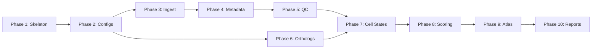

# ConvergentDecidua — MVR 0.1 Implementation Plan

## Status

### Code Written (Phases 1–10)

- [x] **Phase 1 — Project Skeleton** (Epic A)
- [x] **Phase 2 — Configuration & Dataset Registry** (Epics B + D)
- [x] **Phase 3 — Data Ingestion** (Epic C) — *code only, never fetched real data*
- [x] **Phase 4 — Metadata Harmonization** (Epic D) — *tested on synthetic data only*
- [x] **Phase 5 — QC** (Epic E) — *tested on synthetic data only*
- [x] **Phase 6 — Ortholog Mapping** (Epic F) — *code only, never called BioMart*
- [x] **Phase 7 — Cell-State Harmonization & Integration** (Epic G) — *code only, no real h5ad*
- [x] **Phase 8 — Decidualization Scoring** (Epic H) — *tested on synthetic data only*
- [x] **Phase 9 — Baseline DecidualAtlas** (Epic L) — *scaffold only, no data to display*
- [x] **Phase 10 — Reports & Release** (Epic M) — *templates only, no real data*

### Execution Against Real Data (Phases E1–E6)

- [ ] **E1 — Ortholog Backbone** — build backbone.parquet via Ensembl BioMart
- [ ] **E2 — First Dataset (GSE127918)** — fetch, harmonize, QC the key human scRNA dataset
- [ ] **E3 — Remaining Datasets** — fetch + QC all 6 MVR 0.1 datasets
- [ ] **E4 — Cross-Species Integration** — Harmony joint embedding of human + mouse stromal cells
- [ ] **E5 — Scoring + Atlas + Reports** — 8 decidualization modules, Streamlit viewer, reports
- [ ] **E6 — Hardening** — integration tests on real data, final validation, tag v0.1.0

---

## Scope

**MVR 0.1**: Human + mouse comparative decidualization atlas with processed matrices, ortholog backbone, stromal cell-state harmonization, decidualization scoring, and a baseline DecidualAtlas viewer.

See [README.md](README.md) for the full scientific objective, dataset targets, data models, and long-term roadmap (MVR 0.2–1.0). See [docs/AI Phase Plan](docs/AI%20Phase%20Plan%20for%20Convergent%20Regulatory%20Changes%20in%20Spontaneous%20Decidualization.md) for the DeciduaAI model strategy and detailed implementation guidance.

---

## Decisions

| Decision | Choice |
|---|---|
| Scope | MVR 0.1 — human + mouse only |
| Python | 3.11, pure pip/uv (no conda) |
| Workflow | Snakemake (migrate to Nextflow at scale) |
| CLI framework | Click |
| Data storage | Local filesystem + Git LFS; S3 fallback for impractically large files |
| Database | DuckDB + Parquet for MVR 0.1 (PostgreSQL deferred to Phase 3) |
| Testing | pytest |
| CI | GitHub Actions (lint + test + config validation) |

### MVR 0.1 Datasets

| Accession | Species | Assay | Role |
|---|---|---|---|
| GSE111976 | Human | scRNA-seq | Endometrium across natural menstrual cycle |
| GSE127918 | Human | scRNA-seq | Decidual pathway / stromal trajectory |
| GSE183771 | Human | scATAC-seq | Chromatin accessibility across menstrual cycle |
| E-MTAB-11491 | Mouse | scRNA-seq | Cycling and decidualizing mouse FRT |
| GSE226417 | Mouse | scRNA-seq | Early pregnancy decidua / uterus |
| GSE226429 | Mouse | bulk RNA-seq | In vitro decidualization time course |

### Excluded from MVR 0.1

Bat/spiny mouse data, DeciduaAI model runners (scGPT, Geneformer, GENIE3, LINGER, Enformer), GRN inference, sequence-level scoring, convergence engine, PostgreSQL (DeciduaForge), spatial data, perturbation datasets, ChIP-seq.

---

## Dependency Graph

---

## Phase 1 — Project Skeleton (Epic A)

**Goal**: Installable Python package with CLI, CI, and repo structure.

| Step | Deliverable | Details |
|---|---|---|
| A1 | Directory tree | All MVR 0.1 folders per README §4. Excludes `decidua_ai/`, `decidua_forge/`, `src/grn/`, `src/sequence/`, `src/convergence/` |
| A2 | `pyproject.toml` | Package `convergent-decidua`, Python ≥3.11, deps (click, scanpy, anndata, muon, duckdb, pyarrow, pyyaml, rich, snakemake), optional groups `[dev]`/`[atlas]`/`[ingest]`, entry point `wombat`, ruff config |
| A3 | `docker/Dockerfile` | `python:3.11-slim`, install from pyproject.toml |
| A4 | Wombat CLI skeleton | Click group with stub subcommands: `init`, `validate-config`, `fetch`, `build-registry`, `qc`, `orthologs build`, `integrate`, `score-decidua`, `serve-atlas` |
| A5 | `.github/workflows/ci.yml` | Lint (ruff), test (pytest), validate-configs on push/PR |
| A6 | `.pre-commit-config.yaml` | ruff, check-yaml, check-toml, trailing-whitespace |

**Verify**: `pip install -e ".[dev]"` succeeds, `wombat --help` lists all commands, `ruff check .` passes, `pytest` passes, CI green.

---

## Phase 2 — Configuration & Dataset Registry (Epics B + D)

**Goal**: Machine-readable configs and a validated dataset registry.

| Step | Deliverable | Details |
|---|---|---|
| B1 | `configs/species.yaml` | Human + mouse entries (taxon_id, genome_build, ensembl_release, menstruates, spontaneous_decidualization) |
| B2 | `configs/datasets.yaml` | 6 MVR 0.1 datasets with full schema |
| B3 | `configs/markers.yaml` | Cell type markers (README §8) + 8 score gene sets (README §9) |
| B4 | Config loader | `wombat/config.py` — `load_config(name)` with validation |
| B5 | `wombat validate-config` | Loads all YAMLs, checks required keys, reports errors |
| B6 | `wombat build-registry` | Exports to `results/registry.parquet` + CSV |

**Verify**: `wombat validate-config` passes, registry export works, unit tests for malformed YAML.

---

## Phase 3 — Data Ingestion (Epic C)

**Goal**: Download processed matrices and convert to standardized AnnData.

Strategy: **processed-matrix-first** (defer raw FASTQ remapping). See AI Phase Plan for fallback guidance.

| Step | Deliverable | Details |
|---|---|---|
| C1 | `src/ingest/geo.py` | GEO downloader for GSE accessions → `results/raw/{accession}/` |
| C2 | `src/ingest/arrayexpress.py` | ArrayExpress downloader for E-MTAB accessions |
| C3 | `src/ingest/anndata_writer.py` | Convert any format → standardized h5ad with metadata from datasets.yaml |
| C4 | `wombat fetch` wiring | Route by accession prefix, support `--all` |
| C5 | `workflows/rules/fetch.smk` | Snakemake rules: download → h5ad for all 6 datasets |

**Verify**: `wombat fetch --dataset GSE127918` produces h5ad, Snakemake dry-run works, unit tests with mocked HTTP.

---

## Phase 4 — Metadata Harmonization (Epic D)

**Goal**: Consistent `.obs` columns across all h5ad files.

| Step | Deliverable | Details |
|---|---|---|
| D1 | `src/metadata/harmonize.py` | Normalize species, assay, cycle stage, donor/sample |
| D2 | `src/metadata/annotate.py` | Apply harmonized columns to each h5ad |
| D3 | `src/metadata/audit.py` | Metadata completeness report |

**Verify**: All h5ad files have consistent `.obs` columns, no nulls in required fields.

---

## Phase 5 — QC (Epic E)

**Goal**: Filtered, normalized datasets with QC metrics. Runs **parallel with Phase 6**.

| Step | Deliverable | Details |
|---|---|---|
| E1 | `src/qc/scrna.py` | Filter cells/genes, doublet detection, log-normalize, HVG. Params per AI Phase Plan (500+ genes, <15% mito) |
| E2 | `src/qc/scatac.py` | TSS enrichment filter, TF-IDF + LSI |
| E3 | `src/qc/bulk.py` | Low-count filter, normalize |
| E4 | `src/qc/pseudobulk.py` | Aggregate by sample/donor/cell_type |
| E5 | Snakemake rule + CLI | `wombat qc --species human\|mouse` |

**Verify**: Filtered h5ad has fewer cells, `.obs` has QC columns, no empty datasets post-filter.

---

## Phase 6 — Ortholog Mapping (Epic F)

**Goal**: Human↔mouse ortholog tables. Depends only on Phase 2. Runs **parallel with Phases 3–5**.

| Step | Deliverable | Details |
|---|---|---|
| F1 | `src/orthologs/ensembl.py` | BioMart REST API for human↔mouse 1:1 orthologs |
| F2 | `src/orthologs/gprofiler.py` | Cross-validate with g:Orth, flag discrepancies |
| F3 | `src/orthologs/backbone.py` | Tier 1 strict 1:1 → `results/orthologs/backbone.parquet` |
| F4 | Orthogroup table | Tier 2 many-to-many → `results/orthologs/orthogroups.parquet` |
| F5 | Snakemake rule + CLI | `wombat orthologs build` |

**Verify**: ~16K–17K one-to-one pairs, key markers present (PGR, FOXO1, HOXA10, PRL, IGFBP1).

---

## Phase 7 — Cell-State Harmonization & Integration (Epic G)

**Goal**: Cross-species stromal embedding. Depends on Phases 5 + 6.

| Step | Deliverable | Details |
|---|---|---|
| G1 | `src/cell_states/annotate.py` | Marker-based scoring using ontology (README §8) for human + mouse |
| G2 | `src/cell_states/subset.py` | Extract 4 stromal subtypes per species |
| G3 | `src/cell_states/integrate.py` | Map to ortholog backbone → Harmony (default) or scVI (`--method scvi`) → joint embedding |
| G4 | Snakemake rule + CLI | `wombat integrate --mode stromal` |

**Verify**: UMAP shows species mixing with biological signal, PRL/IGFBP1 mark decidual cluster, stromal subtypes recoverable in both species.

---

## Phase 8 — Decidualization Scoring (Epic H)

**Goal**: Per-cell and pseudobulk scores across 8 modules. Depends on Phase 7.

| Step | Deliverable | Details |
|---|---|---|
| H1 | `src/scoring/engine.py` | Generic scoring via `scanpy.tl.score_genes`, species-mapped gene sets via ortholog backbone |
| H2 | `src/scoring/gene_sets.py` | Load from `configs/markers.yaml`, implement all 8 scores (README §9) |
| H3 | Apply scores | Score integrated stromal object + pseudobulk |
| H4 | `src/scoring/reports.py` | Heatmaps and violins by cell state × species |
| H5 | CLI | `wombat score-decidua` |

**Verify**: Decidual_score highest in decidual_stromal, mouse shows lower spontaneous signal, distributions are biologically sensible.

---

## Phase 9 — Baseline DecidualAtlas (Epic L)

**Goal**: Interactive Streamlit viewer. Depends on Phase 8.

| Step | Deliverable | Details |
|---|---|---|
| L1 | `decidual_atlas/app.py` | Multi-page Streamlit app with sidebar nav |
| L2 | Dataset browser page | Registry table with filters |
| L3 | Species comparison | Side-by-side UMAPs, score distributions |
| L4 | Cell-state viewer | Interactive Plotly UMAP by type/species/score |
| L5 | Gene explorer | Search by symbol, DuckDB on Parquet |
| L6 | CLI | `wombat serve-atlas` → `streamlit run decidual_atlas/app.py` |

**Verify**: App launches, all pages render with real data, gene search works.

---

## Phase 10 — Reports & Release (Epic M)

**Goal**: Automated documentation artifacts. Depends on all above.

| Step | Deliverable |
|---|---|
| M1 | Methods report (auto-generated from workflow metadata) |
| M2 | Dataset coverage report |
| M3 | QC report |
| M4 | Ortholog mapping report |
| M5 | Release manifest with checksums |

---

## Design Notes

### Harmony vs scVI for integration

Harmony is CPU-friendly and fast — default for MVR 0.1 local dev. scVI available via `--method scvi` for production GPU runs.

### Data storage strategy

Large h5ad/parquet files go in `results/` which is `.gitignore`'d. The Snakemake workflow re-derives everything from downloads. A data manifest tracks expected outputs for reproducibility. Git LFS is configured in `.gitattributes` for any tracked binary files.

### Processed matrix availability

Some GEO datasets may only have raw FASTQs. Phase 3 validates data availability early — if a core dataset lacks processed matrices, a FASTQ→count alignment step (Cell Ranger / STARsolo) is added.
