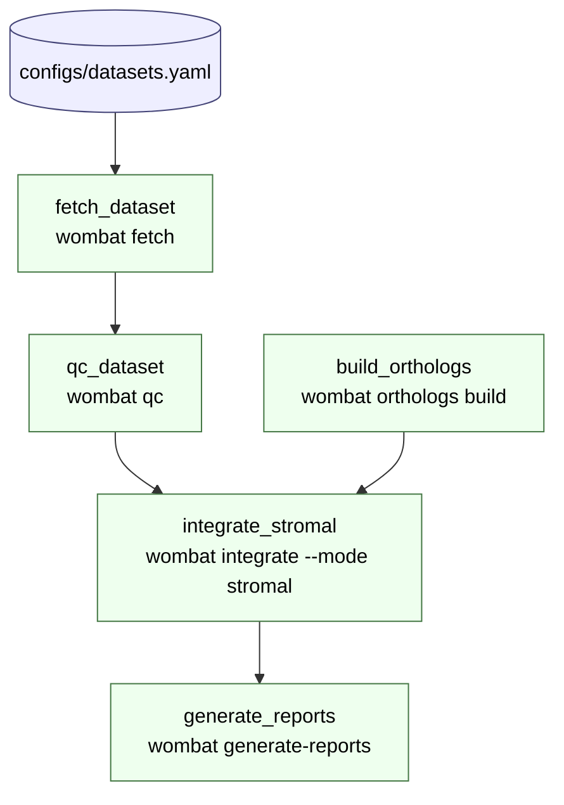

# Workflow DAG

The Snakemake DAG for the cross-species stromal atlas pipeline.

## Pipeline overview



## Per-rule artifacts

| Rule | Output | Producer |
|---|---|---|
| `fetch_dataset` | `results/processed/{accession}.h5ad` | `wombat fetch` |
| `qc_dataset` | `results/qc/{accession}.h5ad` | `wombat qc` |
| `build_orthologs` | `results/orthologs/backbone.parquet` | `wombat orthologs build` |
| `integrate_stromal` | `results/integrated/stromal_cross_species.h5ad` | `wombat integrate` |
| `generate_reports` | `results/reports/*.md` | `wombat generate-reports` |

## Reproducing the DAG

The full DOT-format DAG is checked in at [dag.dot](dag.dot) and can be
re-generated with:

```bash
snakemake --snakefile workflows/Snakefile --dag --forceall > docs/dag.dot
# Optional render (requires graphviz):
dot -Tsvg docs/dag.dot > docs/dag.svg
```

CI dry-runs the DAG on every push (`validate-workflow` job) to catch
broken `include:` paths and rule syntax errors without running data
pipelines.
